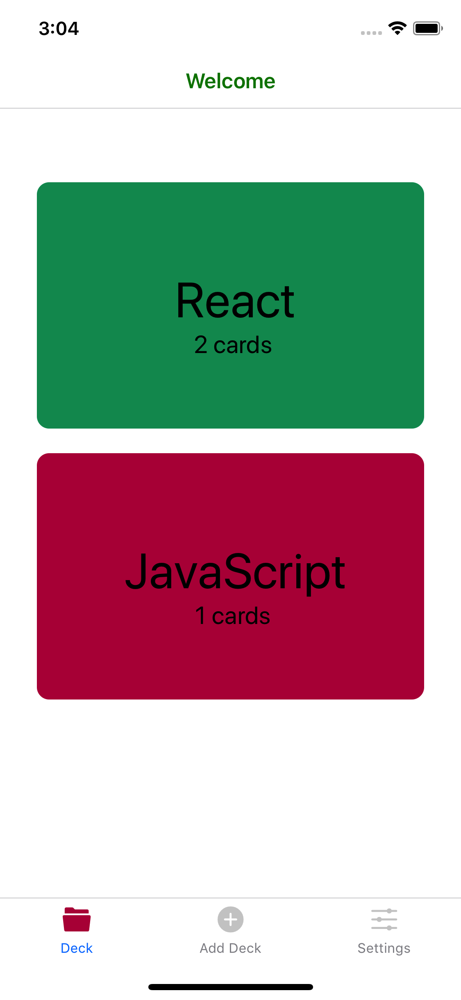
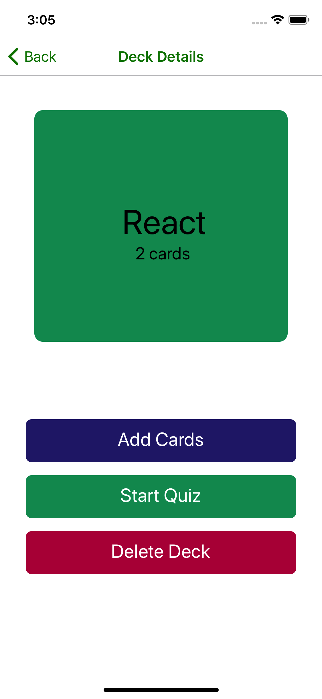
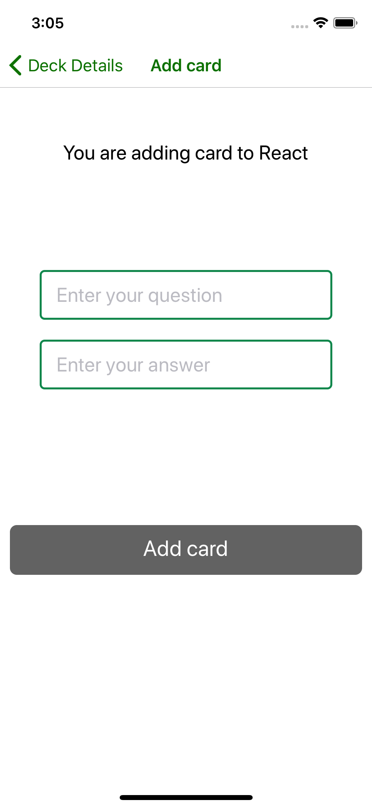
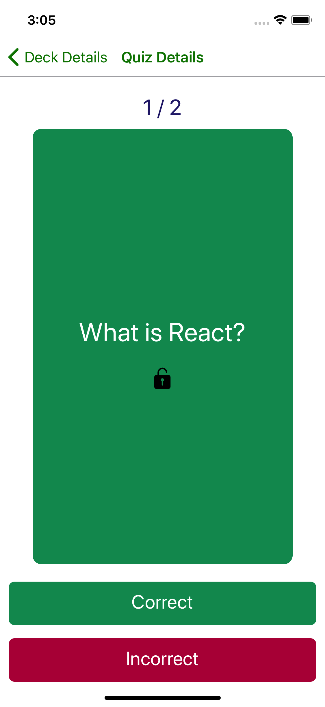
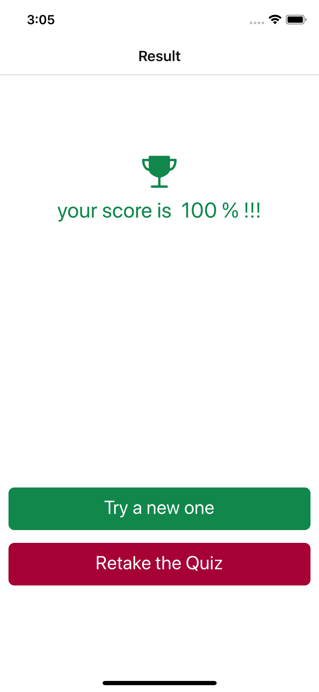
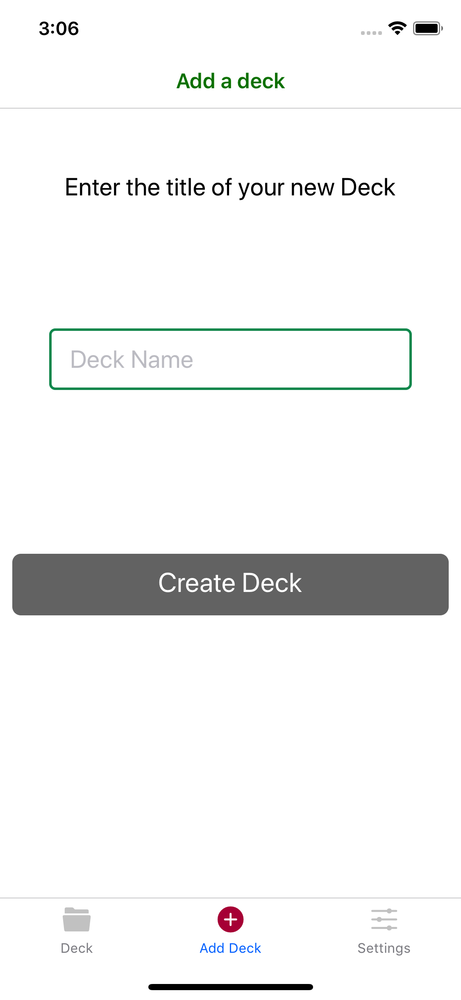

# Mobile-Flash-Cards

## Project Overview
    A mobile application (Android & iOS) that allows users to study collections of flashcards. 
    The app will allow users to create different categories of flashcards called "decks", add flashcards to those decks,           then take quizzes on those decks.

### Given scenarios
- Allow users to create a deck which can hold an unlimited number of cards.
- Allow users to add a card to a specific deck.
- The front of the card should display the question.
- The back of the card should display the answer.
- Users should be able to quiz themselves on a specific deck and receive a score once they're done.
- Users should receive a notification to remind themselves to study if they haven't already for that day.

## Installation
    The projerct is created from a template project of my own (React-Native-Template)
    Clone the repository,and use NPM to install the project dependencies.
    
    `npm install`

## To start the application

- `npm start`
This open Expo in brower
There you can choose the devices and simulators to run

     Please Note:
     This application is build with a tool called Expo , so you will only need NodeJS and NPM (or Yarn) to start it. If you want to run the application on your Android device, download the Expo Client app from the Google Play Store and scan the QR code which is displayed in the command like window after running npm start.

## ScreenShots

